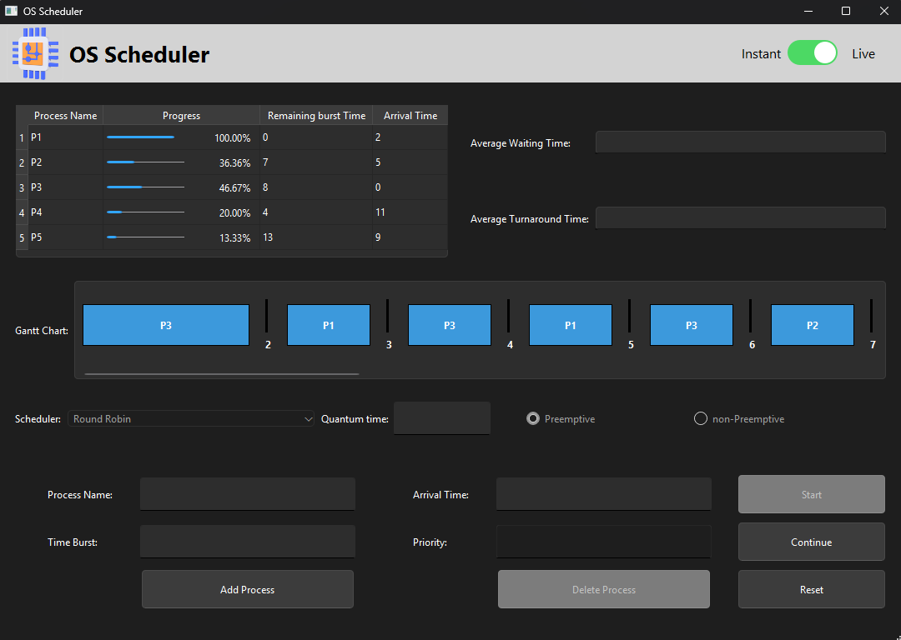

# OS-Scheduler

Dive into the world of Operating Systems with this interactive C++ CPU Scheduling Simulator! Featuring a sleek Qt-based graphical interface, OS-Scheduler brings common scheduling algorithms to life, making learning and experimentation engaging and insightful.



## ✨ Features

*   **Algorithm Playground:** Explore and compare popular scheduling algorithms:
    *   First-Come, First-Served (FCFS)
    *   Shortest Job First (SJF) - Both Preemptive and Non-Preemptive flavors!
    *   Priority Scheduling - With Preemptive and Non-Preemptive options.
    *   Round Robin (RR) - Customize the time quantum to see its effect!
*   **Intuitive GUI:** Effortlessly manage your simulation:
    *   Add processes with their arrival time, burst time, and priority.
    *   Choose your desired scheduling algorithm and preemption settings.
    *   Control the simulation flow: Start, visualize step-by-step (live), or run to completion.
*   **Clear Visualization:** Understand scheduling dynamics at a glance:
    *   Track process states and details in a real-time table.
    *   Visualize execution flow with a dynamic Gantt chart.
*   **Performance Metrics:** Analyze algorithm efficiency:
    *   Automatically calculates Average Waiting Time.
    *   Automatically calculates Average Turnaround Time.
*   **Flexible Simulation:** Choose your pace:
    *   Step through the scheduling decisions live.
    *   Run the entire simulation instantly to see the final results.

## 🛠️ Getting Started

### Using Release Package (Recommended)

1.  Go to the [Releases](https://github.com/ASolimanA/OS-Scheduler/releases) page of this repository.
2.  Find the latest release, usually marked as "Latest".
3.  Under the "Assets" section for that release, download the `.zip` file (e.g., `OS-Scheduler-v0.1.4-win64.zip`).
4.  Extract the contents of the downloaded `.zip` file to the desired location on your computer.
5.  Run the `OS-Scheduler.exe` executable file found inside the extracted folder.

### Using Source Files

1. **Prerequisites**:
   - Git
   - C++ compiler (MinGW compiler preferable)
   - Qt (6.8 or newer is preferable)
   - CMake (3.30 or newer is preferable) 

2. **Clone the repository**:
   ```bash
   git clone https://github.com/ASolimanA/OS-Scheduler.git
   cd OS-Scheduler
   ```

3. **Build the project**:
   - **On Windows with Qt Creator**:
     1. Open Qt Creator
     2. Select "Open Project"
     3. Navigate to the cloned repository and open the "CMakeLists.txt"
     4. Configure the project with your preferred kit
     5. Click the "Build" button (or press Ctrl+B)
     6. Run the application by clicking the "Run" button (or press Ctrl+R)
   
   - **On Windows with CMake**:
     ```powershell
     mkdir build
     cd build
     cmake ..
     cmake --build .
     ```

   - **On Linux/macOS**:
     ```bash
     mkdir build
     cd build
     cmake ..
     make
     ```

4. **Run the application**:
   - The executable will be in the `build` directory or a subdirectory like `build/Debug`
   - Double-click the executable or run it from the command line

## 🙏 Acknowledgements

A big thank you to everyone who contributes to open-source and makes learning resources available!

And special thanks to the Qt framework for enabling the creation of the user interface.

## 📝 License

This project is licensed under the MIT License - see the [LICENSE](LICENSE) file for details.
